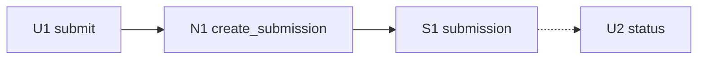

# Proposal Breadboarding

Breadboarding exposes wiring before implementation. It prescribes no code and no visual design.

## Model

- `P#` — place or trigger where interaction/runtime flow begins.
- `U#` — user-facing affordance.
- `N#` — named code/domain affordance.
- `S#` — durable or runtime state.
- `~` — optional element that scope may cut.

Prefer domain-language names. In FindMeAFlat an `N#` names an Ash action/code interface, a Telegram command or wizard step, an Oban worker boundary, a `PortalGate` pacing boundary, or a portal fetch/parse adapter — not a private implementation step.

## Tables

Record only columns that help verify connections:

```markdown
### Places

| ID | Place/trigger | Actor and purpose |
| --- | --- | --- |

### Affordances and state

| ID | Place | Affordance/state | Trigger | Wires to | Returns to |
| --- | --- | --- | --- | --- | --- |
```

Every reference must resolve. Every displayed value needs a source; every write needs a reader or externally observable effect. Navigation targets a place; domain calls target public interfaces. Show failure/retry paths when effects can fail.

## Diagram

Use Mermaid only for three or more dependent places/boundaries or branching flow. Solid arrows for control/effects, dashed for returned data:



Update tables first, then regenerate the diagram. Walk one success journey and each material failure/authorization/retry branch. Fix missing or dead nodes before Shape Go.

## Provisional Slices

Group connected affordances into the smallest demoable user-facing or operational outcomes. A slice may cross UI, domain, persistence, and effects; a technical layer alone is not one. These groups guide `plan-work`; they are not an implementation plan.
